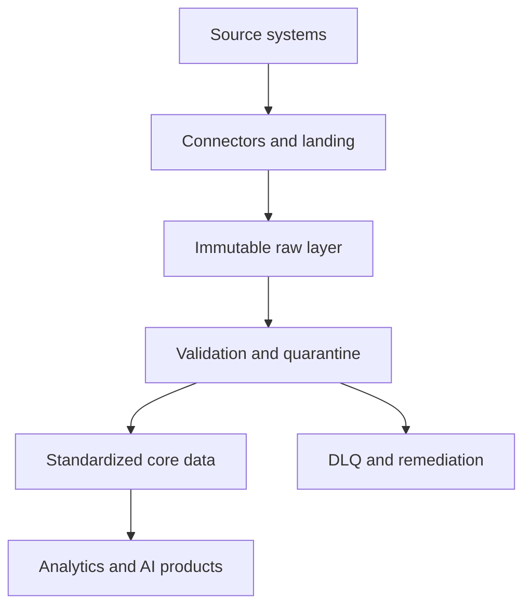

# Phase 1.3 — Data Ingestion and Integration

## Phase scope

Data ingestion moves data from source systems into a platform where it can be validated, transformed, governed, analyzed, and served to applications or AI systems.

Data integration goes further: it combines data from different systems into a consistent, usable representation.

This phase covers:

* ETL and ELT.
* Batch and streaming ingestion.
* Full and incremental loading.
* File, API, database, webhook, and event ingestion.
* Change Data Capture.
* Idempotency and deduplication.
* Retries, backoff, and checkpointing.
* Ordering, watermarks, and late-arriving data.
* Dead-letter queues and poison records.
* Backfills and reprocessing.
* Delivery guarantees.
* Schema evolution and data contracts.
* Metadata, lineage, observability, and security.
* Modern ingestion architecture.
* Ingestion for analytics, data mesh, and AI.

---

# 1. Understanding data ingestion

## 1.1 What is data ingestion?

Data ingestion is the process of collecting data from one or more source systems and transferring it into a destination system.

```text
Source → Extract → Transfer → Validate → Store
```

Possible sources include:

* Relational databases.
* SaaS applications.
* REST APIs.
* CSV, JSON, XML, or Parquet files.
* Message brokers.
* Application logs.
* IoT devices.
* Webhooks.
* Object storage.
* Mainframe systems.
* Third-party data providers.

Possible destinations include:

* Operational databases.
* Data warehouses.
* Data lakes.
* Lakehouses.
* Message brokers.
* Search engines.
* Vector databases.
* Feature stores.
* Graph databases.

In the Elder-Care example:

```text
Hospital appointments ─┐
Caregiver notes ────────┼──> Ingestion platform
Follow-up files ────────┤
Smartwatch events ──────┘
```

The ingestion layer should preserve enough source context to answer:

* Where did this record originate?
* When was it created at the source?
* When was it ingested?
* Which pipeline loaded it?
* Was it modified during ingestion?
* Which schema version was used?
* Was it accepted, rejected, or quarantined?

---

## 1.2 Ingestion versus integration

These terms are related but not identical.

| Concept         | Purpose                                            |
| --------------- | -------------------------------------------------- |
| Ingestion       | Move data from source to destination               |
| Integration     | Combine and reconcile data from different sources  |
| Transformation  | Change data structure or values                    |
| Replication     | Maintain a copy of source data                     |
| Synchronization | Keep multiple systems aligned                      |
| Federation      | Query data across systems without fully copying it |

For example:

1. A hospital appointment file is copied into a lake.
2. A clinic appointment API is queried.
3. Both datasets are standardized.
4. Status values such as `DONE`, `CLOSED`, and `COMPLETED` are mapped to `COMPLETED`.
5. Duplicate appointments are identified.

Steps 1 and 2 are mainly ingestion. Steps 3–5 are integration.

---

## 1.3 Why ingestion is difficult

Moving bytes is easy. Moving data reliably while preserving meaning is difficult.

Real source systems may produce:

* Duplicate records.
* Missing records.
* Invalid values.
* Out-of-order events.
* Late-arriving data.
* Changed schemas.
* Deleted records.
* Reused identifiers.
* Partial files.
* Multiple updates to the same object.
* Inconsistent timestamps.
* Sensitive information.
* Temporary failures.
* Records that fail repeatedly.

A production ingestion system must therefore address:

```text
Correctness + Reliability + Recoverability +
Scalability + Security + Observability
```

---

# 2. Source and destination systems

## 2.1 Source systems

A source system is the system that produces or owns the original data.

Examples:

* PostgreSQL appointment database.
* Salesforce customer records.
* Hospital scheduling API.
* Kafka telemetry topic.
* CSV file uploaded by a care provider.
* Caregiver-notes document repository.

The source-system contract should identify:

* Source owner.
* Extraction method.
* Expected schema.
* Data volume.
* Update frequency.
* Business key.
* Change semantics.
* Deletion behaviour.
* Rate limits.
* Availability expectations.
* Security classification.

The ingestion team should not assume that every source behaves like a clean relational database.

---

## 2.2 Destination systems

The destination depends on the use case.

| Destination          | Typical purpose                       |
| -------------------- | ------------------------------------- |
| Operational database | Application reads and writes          |
| Data warehouse       | Structured analytics                  |
| Data lake            | Low-cost raw and historical storage   |
| Lakehouse            | Analytical tables over object storage |
| Kafka topic          | Event distribution                    |
| Search index         | Full-text and filtered search         |
| Vector database      | Semantic retrieval                    |
| Feature store        | ML feature serving                    |
| Graph database       | Relationship-oriented analysis        |

A single ingested record may eventually be published to multiple destinations.

For example:

```text
Caregiver note
    ├──> Raw object storage
    ├──> Structured warehouse table
    ├──> Search index
    └──> Vector retrieval index
```

Each destination has different consistency, schema, latency, and indexing requirements.

---

# 3. ETL and ELT

## 3.1 ETL

ETL means:

1. Extract.
2. Transform.
3. Load.

```text
Source → Transformation engine → Target
```

The data is transformed before being loaded into the final destination.

Example:

1. Read appointment records from a database.
2. Standardize dates and status codes.
3. Reject invalid records.
4. Load clean records into the warehouse.

ETL is useful when:

* The target should receive only validated data.
* Source data contains sensitive fields that must be removed.
* The destination cannot efficiently perform transformations.
* Strict preprocessing is required.
* The target has limited storage or compute.

### Advantages

* Invalid data can be stopped before final loading.
* Sensitive data can be masked before entering the target.
* Target storage remains relatively clean.
* Works with destinations having limited transformation capabilities.

### Disadvantages

* Raw data may be lost unless separately preserved.
* Transformation logic can become difficult to reprocess.
* Upstream transformation engines may become bottlenecks.
* Changing business rules can require re-extraction.

---

## 3.2 ELT

ELT means:

1. Extract.
2. Load.
3. Transform.

```text
Source → Raw destination → Transformation models
```

Data is first loaded into a warehouse, lake, or lakehouse. Transformations are then performed inside or near the destination.

Example:

```text
PostgreSQL → Raw warehouse schema → dbt staging → core → marts
```

ELT is common in modern cloud data platforms because warehouses and lakehouses provide scalable storage and compute.

### Advantages

* Raw source data is retained.
* Transformations can be rerun.
* New use cases can reuse historical data.
* Warehouse or lakehouse compute can process transformations.
* Ingestion and business transformation remain separated.

### Disadvantages

* Sensitive or poor-quality data may enter the raw environment.
* Raw storage requires strong access controls.
* Compute costs can rise without workload management.
* Poorly governed raw zones can become data swamps.

---

## 3.3 ETL versus ELT

| Consideration              | ETL                     | ELT                              |
| -------------------------- | ----------------------- | -------------------------------- |
| Transformation timing      | Before loading          | After loading                    |
| Raw data retained          | Not always              | Usually                          |
| Reprocessing flexibility   | Lower                   | Higher                           |
| Target compute requirement | Lower                   | Higher                           |
| Sensitive-data filtering   | Before target           | Must be controlled in raw layer  |
| Typical environment        | Traditional integration | Cloud warehouse/lakehouse        |
| Business logic location    | External pipeline       | Destination transformation layer |

Many platforms use a hybrid model:

```text
Extract
  ↓
Perform minimum safety transformations
  ↓
Load immutable raw data
  ↓
Perform business transformations
```

Minimum safety transformations might include:

* Encryption.
* Malware scanning.
* Decompression.
* Basic format validation.
* Tokenization of sensitive identifiers.
* Removal of prohibited fields.

---

# 4. Batch and streaming ingestion

## 4.1 Batch ingestion

Batch ingestion processes a bounded collection of records at scheduled or manually triggered intervals.

Examples:

* Nightly database extract.
* Hourly API synchronization.
* Weekly CSV upload.
* Daily processing of caregiver documents.
* Monthly financial close data.

```text
Records accumulated during interval
              ↓
        Batch execution
              ↓
       Destination load
```

### Advantages

* Simpler to develop and operate.
* Easy to rerun.
* Efficient for large bounded datasets.
* Suitable when minute-level latency is unnecessary.
* Easier reconciliation and auditing.

### Disadvantages

* Data becomes available only after the batch runs.
* Large batches may create resource spikes.
* Failures can affect a large interval of data.
* Current-state systems may remain stale between runs.

---

## 4.2 Streaming ingestion

Streaming ingestion processes continuously arriving events, usually with low latency.

Examples:

* Smartwatch heart-rate events.
* Application click events.
* Payment transactions.
* Alert acknowledgements.
* Database changes through CDC.

```text
Event → Broker → Stream processor → Destination
```

Streaming does not always mean one record is processed instantly. Systems frequently use micro-batches containing small groups of events.

### Advantages

* Low-latency availability.
* Supports monitoring and alerting.
* Spreads processing over time.
* Enables event-driven applications.

### Disadvantages

* More complex failure handling.
* Ordering and late data become important.
* State management is difficult.
* Continuous infrastructure must be monitored.
* Reprocessing requires retained event history.

---

## 4.3 Batch versus streaming

| Consideration    | Batch                       | Streaming                          |
| ---------------- | --------------------------- | ---------------------------------- |
| Input            | Bounded                     | Unbounded                          |
| Typical latency  | Minutes to days             | Milliseconds to minutes            |
| Processing       | Scheduled runs              | Continuous                         |
| Recovery         | Rerun batch                 | Replay events/checkpoints          |
| Complexity       | Lower                       | Higher                             |
| Ordering concern | Usually file or query based | Important                          |
| State management | Run-level                   | Continuous                         |
| Best fit         | Reporting, bulk integration | Alerts, telemetry, live operations |

The correct choice depends on the business requirement.

If care reports are updated every night, batch may be sufficient. If an alert must be created shortly after abnormal telemetry arrives, streaming is required.

Streaming should not be selected simply because it appears more advanced.

---

## 4.4 Lambda and Kappa architectures

### Lambda architecture

Lambda uses separate batch and streaming paths.

```text
                 ┌──> Batch layer ──────┐
Source events ───┤                      ├──> Serving layer
                 └──> Streaming layer ──┘
```

The streaming layer provides low-latency results, while the batch layer later produces complete and corrected results.

Problem: the same business logic may need to be implemented twice.

### Kappa architecture

Kappa treats retained event streams as the central source for both real-time processing and reprocessing.

```text
Event log → Stream processor → Serving tables
       ↑
       └──── Replay for reprocessing
```

Kappa can simplify architecture when business data can be represented reliably as replayable events.

It is less suitable when important inputs are naturally large files, snapshots, or external datasets that are not event streams.

---

# 5. Full and incremental loading

## 5.1 Full load

A full load extracts the complete source dataset during every run.

```sql
SELECT *
FROM appointments;
```

The target may be:

* Replaced completely.
* Truncated and reloaded.
* Compared against the previous version.
* Loaded into a new snapshot partition.

### Advantages

* Simple extraction logic.
* Naturally captures the current source state.
* Useful for small reference datasets.
* Avoids reliance on change-tracking columns.

### Disadvantages

* Expensive for large tables.
* Repeatedly transfers unchanged data.
* Can place heavy load on the source.
* Makes deletion and history handling difficult.
* May exceed the available batch window.

Full loading is reasonable when:

* The source table is small.
* Changes cannot be identified reliably.
* The data is refreshed infrequently.
* Complete replacement is expected.
* Source snapshots have compliance or audit value.

---

## 5.2 Incremental load

An incremental load extracts only records that are new or changed since the last successful run.

Possible methods include:

* Increasing numeric identifier.
* `updated_at` timestamp.
* Source-system version number.
* Change-tracking table.
* CDC log.
* File arrival metadata.
* Partition discovery.
* Content hash comparison.

Example:

```sql
SELECT *
FROM appointments
WHERE updated_at > :last_watermark
  AND updated_at <= :current_watermark;
```

### Advantages

* Transfers less data.
* Reduces source-system load.
* Shortens processing time.
* Scales better for large datasets.

### Disadvantages

* Requires reliable change identification.
* Deletes may be missed.
* Clock differences can create gaps.
* Late updates can be skipped.
* Watermark management becomes critical.
* A failed run must not incorrectly advance the checkpoint.

---

## 5.3 Incremental overlap windows

A strict query such as:

```sql
WHERE updated_at > last_successful_timestamp
```

can miss records because of:

* Timestamp precision differences.
* Delayed commits.
* Clock skew.
* Transaction boundaries.
* Records arriving with old timestamps.

A safer approach may reread an overlap window:

```sql
WHERE updated_at >= last_successful_timestamp - INTERVAL '10 minutes'
```

This deliberately rereads some records. Idempotent processing and deduplication then prevent duplicate target rows.

```text
Small overlap + deterministic deduplication
```

is often safer than attempting a perfectly non-overlapping extraction.

---

## 5.4 High-water marks

A high-water mark records how far an incremental pipeline has processed.

Examples:

* Maximum source ID.
* Maximum update timestamp.
* Kafka offset.
* File modification time.
* Log sequence number.

A checkpoint should be advanced only after the corresponding data has been durably processed.

Unsafe sequence:

```text
Extract → Advance checkpoint → Load fails
```

The pipeline may skip the failed records during the next run.

Safer sequence:

```text
Extract → Validate → Load → Commit → Advance checkpoint
```

Checkpoint state must be treated as operational data and stored reliably.

---

# 6. File-based ingestion

## 6.1 Common file formats

| Format  | Strengths                           | Limitations                        |
| ------- | ----------------------------------- | ---------------------------------- |
| CSV     | Simple and widely supported         | Weak typing and escaping problems  |
| JSON    | Flexible and nested                 | Verbose and expensive to scan      |
| JSONL   | Stream-friendly record format       | Still verbose                      |
| XML     | Strong structure and legacy support | Verbose and complex                |
| Avro    | Typed, compact, supports evolution  | Requires schema-aware tooling      |
| Parquet | Columnar, compressed, analytical    | Not ideal for individual updates   |
| ORC     | Columnar analytical format          | Ecosystem-dependent                |
| Excel   | Business-friendly                   | Weak automation and schema control |

---

## 6.2 Safe file arrival

A file should not be processed while it is still being uploaded.

Safer patterns include:

* Upload using a temporary name, then rename.
* Upload into a temporary directory, then move.
* Use a manifest declaring expected files.
* Use an object-store completion event.
* Verify stable size across checks.
* Require a checksum or completion marker.

Example:

```text
appointments.csv.uploading
             ↓ upload completes
appointments.csv.ready
```

The pipeline processes only `.ready` files.

---

## 6.3 File manifests

A manifest describes the expected delivery.

```yaml
delivery_id: hospital_a_2026_08_10
files:
  - name: appointments.csv
    record_count: 12500
    sha256: "..."
  - name: elders.csv
    record_count: 4100
    sha256: "..."
schema_version: "2.1"
generated_at: "2026-08-10T01:00:00Z"
```

The ingestion system can verify:

* Required files exist.
* Record counts match.
* Checksums match.
* Schema versions are supported.
* Files have not already been processed.

---

## 6.4 File-level idempotency

A file may be delivered more than once.

Possible file identity methods include:

* Delivery ID.
* Source path plus filename.
* File checksum.
* Object version ID.
* Manifest identifier.

Filename alone is often insufficient because a source may overwrite a file while retaining the same name.

A file-ingestion audit table might contain:

```text
delivery_id
file_name
file_checksum
received_at
processing_started_at
processing_completed_at
status
records_received
records_accepted
records_rejected
pipeline_run_id
```

---

## 6.5 Small-file problem

Thousands of tiny files can degrade analytical performance because the platform must repeatedly:

* List objects.
* Open files.
* Read metadata.
* Schedule tasks.
* Close files.

Mitigation techniques include:

* File compaction.
* Partition-aware writing.
* Minimum target file sizes.
* Micro-batching.
* Table formats such as Delta Lake, Iceberg, or Hudi.
* Scheduled optimization.

---

# 7. API-based ingestion

## 7.1 REST API ingestion

API ingestion commonly uses HTTP operations such as:

```http
GET /appointments
GET /appointments/{id}
```

Important concerns include:

* Authentication.
* Pagination.
* Rate limits.
* Request timeouts.
* Retries.
* Partial responses.
* Cursor expiry.
* Schema changes.
* API versioning.
* Incremental filtering.

---

## 7.2 Pagination

Common pagination models include:

### Offset pagination

```http
GET /appointments?offset=100&limit=50
```

Simple, but records may shift when the underlying dataset changes.

### Page-number pagination

```http
GET /appointments?page=3&page_size=50
```

Easy to use, but has similar mutation problems.

### Cursor pagination

```http
GET /appointments?cursor=eyJpZCI6MTAwfQ==
```

Usually more stable for changing datasets.

### Keyset pagination

```http
GET /appointments?after_id=1000&limit=100
```

Efficient when records have a stable ordered key.

The pipeline should persist the last successful cursor only after the page has been processed safely.

---

## 7.3 Rate limiting

An API may return:

```http
429 Too Many Requests
```

The client should respect:

* `Retry-After`.
* Requests-per-second limits.
* Daily quotas.
* Concurrent-request limits.

Aggressive retrying can make the problem worse.

A suitable approach is exponential backoff with jitter:

```text
delay = min(max_delay, base × 2^attempt) + random_jitter
```

Jitter prevents many workers from retrying at exactly the same time.

---

## 7.4 API extraction audit

For every request or page, capture:

* Endpoint.
* Request time.
* Response status.
* Page or cursor.
* Attempt count.
* Records returned.
* Rate-limit headers.
* Correlation ID.
* Pipeline run ID.
* Error category.

Sensitive request headers and tokens must not be written to logs.

---

# 8. Database ingestion

## 8.1 Query-based extraction

A pipeline may connect directly to a source database and execute queries.

Example:

```sql
SELECT appointment_id,
       elder_id,
       provider_id,
       status,
       updated_at
FROM operational.appointment
WHERE updated_at >= :window_start
  AND updated_at < :window_end;
```

Good practices include:

* Use a read replica when possible.
* Filter using indexed columns.
* Extract in bounded pages.
* Avoid long-running open transactions.
* Restrict database permissions.
* Use encrypted connections.
* Set query and connection timeouts.
* Monitor load on the source.

---

## 8.2 Snapshot extraction

A snapshot captures the state of a table at a particular time.

Snapshots are useful when:

* Change logs are unavailable.
* Current-state comparison is sufficient.
* Tables are reasonably small.
* Audit snapshots are required.

Successive snapshots can be compared using:

* Business keys.
* Row hashes.
* Set differences.
* Effective-date logic.

However, snapshot comparison can be computationally expensive and may not preserve every intermediate change.

---

## 8.3 Consistent snapshots

Extracting related tables independently can produce inconsistent results.

Example:

1. Appointment row is extracted.
2. Source transaction changes its provider.
3. Provider table is extracted afterward.

The extracted tables may represent different points in time.

Database-supported consistent snapshots or transaction-isolation mechanisms can reduce this problem.

The exact method depends on the database and the acceptable source-system impact.

---

# 9. Change Data Capture

## 9.1 What is CDC?

Change Data Capture identifies inserts, updates, and deletes made in a source system and publishes them for downstream processing.

```text
Source database changes
          ↓
      CDC mechanism
          ↓
 Insert / Update / Delete events
          ↓
   Downstream consumers
```

CDC is commonly used for:

* Database replication.
* Near-real-time analytics.
* Cache synchronization.
* Search indexing.
* Event-driven integration.
* Lakehouse ingestion.

---

## 9.2 Timestamp-based CDC

A basic form uses an `updated_at` column.

```sql
SELECT *
FROM elder
WHERE updated_at > :last_processed_time;
```

Advantages:

* Simple.
* Requires little infrastructure.
* Easy to understand.

Limitations:

* Deletes are not naturally captured.
* Source applications must update the timestamp correctly.
* Multiple changes between extracts collapse into the latest state.
* Clock and precision issues can miss records.
* Bulk corrections may not update the field.

---

## 9.3 Trigger-based CDC

Database triggers write changes to a separate audit or outbox table.

Example:

```text
Appointment updated
       ↓
Database trigger
       ↓
appointment_change_log
```

Advantages:

* Can capture inserts, updates, and deletes.
* Supports custom change metadata.
* Does not depend only on timestamps.

Limitations:

* Adds work to source transactions.
* Trigger logic can become difficult to maintain.
* Incorrect triggers can affect production applications.
* Schema changes must update trigger logic.

---

## 9.4 Log-based CDC

Log-based CDC reads database transaction logs, such as:

* PostgreSQL Write-Ahead Log.
* MySQL binary log.
* SQL Server transaction log.
* Oracle redo log.

Conceptually:

```text
Application transaction
          ↓
Database transaction log
          ↓
CDC connector
          ↓
Change event stream
```

Advantages:

* Low intrusion into application queries.
* Captures inserts, updates, and deletes.
* Preserves commit order.
* Supports near-real-time replication.
* Can expose transaction metadata.

Limitations:

* Requires database-specific configuration.
* Log retention must be managed.
* Schema changes require careful handling.
* Initial snapshots and streaming changes must be coordinated.
* Connectors need secure privileged access.

Tools such as Debezium commonly use log-based CDC and publish changes to Kafka-compatible systems.

---

## 9.5 CDC event structure

A CDC event may contain:

```json
{
  "operation": "UPDATE",
  "source": {
    "database": "care_ops",
    "table": "appointment",
    "log_position": "0/16B6C50"
  },
  "before": {
    "appointment_id": "A101",
    "status": "SCHEDULED"
  },
  "after": {
    "appointment_id": "A101",
    "status": "COMPLETED"
  },
  "event_time": "2026-08-10T08:15:00Z"
}
```

The operation is commonly represented as:

* `c`: create.
* `u`: update.
* `d`: delete.
* `r`: snapshot read.

The exact format depends on the CDC platform.

---

## 9.6 Initial snapshot and CDC handoff

A new CDC pipeline usually needs:

1. Existing database rows.
2. Future database changes.

The system must avoid a gap between the initial snapshot and the start of log processing.

Conceptually:

```text
Record log position
        ↓
Take consistent snapshot
        ↓
Publish snapshot rows
        ↓
Continue reading changes after recorded position
```

Incorrect coordination can create missing or duplicated changes. Duplicates are usually safer than missing records if consumers are idempotent.

---

## 9.7 Handling deletes

Deletion strategies include:

### Hard delete

Remove the target row.

### Soft delete

Set a field such as:

```text
is_deleted = true
deleted_at = timestamp
```

### Tombstone event

Publish an event indicating that the key no longer has a current value.

### Historical close

Close the active record:

```text
valid_to = deletion_time
is_current = false
```

The correct choice depends on:

* Audit requirements.
* Analytical history.
* Privacy deletion requirements.
* Consumer behaviour.
* Source semantics.

A technical delete event does not automatically establish whether historical data must also be erased.

---

# 10. Webhooks and event-driven ingestion

## 10.1 Webhooks

A webhook allows a source system to notify a destination when an event occurs.

```text
Source event → HTTP POST → Webhook receiver
```

Example:

```json
{
  "event_id": "evt_901",
  "event_type": "appointment.completed",
  "occurred_at": "2026-08-10T08:20:00Z",
  "appointment_id": "A101"
}
```

Webhooks provide lower latency than repeatedly polling an API.

---

## 10.2 Webhook reliability

Webhook receivers should:

* Authenticate the sender.
* Verify signatures.
* Validate timestamps.
* Reject replayed requests.
* Respond quickly.
* Persist the event before processing.
* Process asynchronously.
* Deduplicate using an event ID.
* retain audit evidence.

A safe pattern is:

```text
Webhook request
      ↓
Authenticate and validate
      ↓
Durably store or enqueue
      ↓
Return success
      ↓
Process asynchronously
```

Performing complex processing before acknowledging the request can cause source timeouts and duplicate deliveries.

---

## 10.3 Polling versus webhooks

| Aspect                | Polling                     | Webhooks                          |
| --------------------- | --------------------------- | --------------------------------- |
| Initiator             | Consumer                    | Source                            |
| Latency               | Depends on polling interval | Usually lower                     |
| Unnecessary requests  | Possible                    | Fewer                             |
| Firewall exposure     | Usually outbound only       | Receiver endpoint required        |
| Missed-event recovery | Query source again          | Requires replay or reconciliation |
| Implementation        | Often simpler               | Requires secure endpoint          |

A robust design may combine both:

* Webhooks for low latency.
* Periodic API reconciliation for completeness.

---

# 11. Message queues and event brokers

## 11.1 Queue model

A message queue usually distributes work among consumers.

```text
Producer → Queue → Consumer
```

Once one consumer successfully processes a message, it is acknowledged and removed or marked complete.

Suitable for:

* Background jobs.
* Task distribution.
* Email generation.
* File-processing requests.
* Independent work items.

---

## 11.2 Event-log model

Systems such as Kafka retain ordered records in partitions.

```text
Producer → Topic partition → Consumer group
```

Consumers track offsets and can replay retained events.

Suitable for:

* Event streams.
* CDC.
* Multiple independent consumers.
* Reprocessing.
* High-throughput ingestion.

---

## 11.3 Queue versus event log

| Aspect         | Traditional queue                      | Retained event log                 |
| -------------- | -------------------------------------- | ---------------------------------- |
| Main purpose   | Distribute work                        | Store and distribute events        |
| Consumption    | Message usually handled once per group | Multiple groups read independently |
| Replay         | Often limited                          | Central capability                 |
| Ordering       | Queue-dependent                        | Usually within partition           |
| Retention      | Until acknowledged or expiry           | Time/size-based                    |
| Consumer state | Broker acknowledgements                | Consumer offsets                   |

---

## 11.4 Partitions and ordering

Kafka-style brokers divide topics into partitions.

```text
Topic
  ├── Partition 0: E1 events
  ├── Partition 1: E2 events
  └── Partition 2: E3 events
```

Ordering is generally guaranteed only within one partition.

If events for the same elder must remain ordered, the producer can use `elder_id` as the partition key.

Trade-off:

* Same key gives consistent ordering.
* Poor key selection may create skew.
* One very active key may overload a partition.

---

# 12. Idempotency

## 12.1 What is idempotency?

An operation is idempotent when repeating it produces the same final state as applying it once.

```text
process(event) once  = final state X
process(event) twice = final state X
```

Retries are unavoidable in distributed systems. Idempotency prevents retries from corrupting data.

---

## 12.2 Idempotency keys

An idempotency key uniquely identifies a logical request or event.

Examples:

* Source event ID.
* File delivery ID.
* `(source_system, source_record_id, source_version)`.
* API request ID.
* Kafka topic, partition, and offset.
* Deterministic record hash.

A processing table might store:

```text
idempotency_key
first_seen_at
processing_status
result_reference
payload_hash
```

If the key is seen again:

* Same key and same payload: treat as duplicate.
* Same key but different payload: raise a conflict or quality alert.

---

## 12.3 Upsert

An upsert performs an insert or update based on a key.

Conceptually:

```sql
INSERT INTO appointment (...)
VALUES (...)
ON CONFLICT (source_system, source_appointment_id)
DO UPDATE SET
    status = EXCLUDED.status,
    updated_at = EXCLUDED.updated_at;
```

Upserts support idempotency, but only if:

* The conflict key represents correct business identity.
* Updates do not overwrite newer data with older data.
* Deletion and history requirements are handled.
* Repeated processing does not create duplicate child records.

---

# 13. Deduplication

## 13.1 Technical versus business duplicates

A technical duplicate is the same event or record delivered more than once.

A business duplicate consists of different records representing the same real-world entity.

Examples:

```text
Technical duplicate:
event_id evt_100 delivered twice

Business duplicate:
Hospital elder H101 and clinic elder C778
represent the same person
```

Technical deduplication may use an event ID. Business deduplication may require identity resolution.

---

## 13.2 Deduplication keys

Possible deduplication keys include:

* Exact event ID.
* Source primary key.
* Composite business key.
* Payload hash.
* Time-window key.
* Fuzzy entity match.

Example technical key:

```text
(source_system, source_event_id)
```

Example appointment key:

```text
(source_system, source_appointment_id)
```

Example derived key:

```text
hash(elder_id, provider_id, scheduled_at, appointment_type)
```

Derived keys must be designed carefully because legitimate events may share similar values.

---

## 13.3 Window-based deduplication

Streaming systems often retain recently seen identifiers for a bounded interval.

```text
If event_id was seen during last 24 hours:
    suppress duplicate
else:
    process and remember event_id
```

The window limits state size, but duplicates arriving after the window may be processed again.

The window should reflect:

* Expected retry duration.
* Broker retention.
* Source behaviour.
* Business impact of duplicates.
* Available state storage.

---

# 14. Retry strategies

## 14.1 Transient and permanent failures

Failures should be classified.

### Transient failures

* Network timeout.
* Temporary database unavailability.
* HTTP 429.
* HTTP 503.
* Temporary broker disconnect.

These may succeed after a retry.

### Permanent failures

* Invalid schema.
* Missing required identifier.
* Unsupported status value.
* Authentication permanently revoked.
* Malformed record.
* Business rule violation.

Retrying permanent failures repeatedly wastes resources.

---

## 14.2 Exponential backoff

A retry schedule might use:

```text
Attempt 1: wait 1 second
Attempt 2: wait 2 seconds
Attempt 3: wait 4 seconds
Attempt 4: wait 8 seconds
```

A maximum delay and maximum attempt count should be configured.

Random jitter should be added so multiple failed workers do not retry simultaneously.

---

## 14.3 Retry boundaries

Retry at the smallest safe unit.

Possible units include:

* Entire pipeline.
* File.
* API page.
* Database partition.
* Message.
* Destination batch.

Retrying the entire ingestion job because one record failed can be expensive. Retrying only one record can also be inefficient when the failure affects the entire destination.

The retry boundary should match the failure boundary.

---

# 15. Dead-letter queues and quarantine

## 15.1 Dead-letter queue

A dead-letter queue, or DLQ, stores records that could not be processed successfully after defined attempts.

A DLQ record should contain:

* Original payload or secure reference.
* Error category.
* Error message.
* Source.
* Event identifier.
* Schema version.
* First failure time.
* Last failure time.
* Attempt count.
* Pipeline version.
* Correlation ID.

Sensitive values should be masked or protected.

---

## 15.2 Poison records

A poison record repeatedly causes processing failure.

Examples:

* Malformed JSON.
* Invalid binary encoding.
* Extremely large unexpected field.
* Unsupported schema version.
* Record triggering a deterministic code defect.

Without isolation, one poison record can block an entire partition or batch.

The system should:

1. Detect repeat failure.
2. Move the record to quarantine or DLQ.
3. Continue processing safe records where ordering rules permit.
4. Alert the responsible owner.
5. Support controlled correction and replay.

---

## 15.3 DLQ is not a final destination

A DLQ requires an operating process:

```text
Detect → Classify → Assign → Correct → Replay → Verify → Close
```

A DLQ that nobody monitors becomes silent data loss.

Useful DLQ metrics include:

* Records added per hour.
* Oldest unresolved record.
* Error categories.
* Replay success rate.
* Repeated failure count.
* Source-system distribution.

---

# 16. Checkpointing and recovery

## 16.1 Checkpoint

A checkpoint records completed processing progress.

Examples:

* Last processed file.
* Last successful API cursor.
* Maximum committed source timestamp.
* Kafka offsets.
* Stream-processing state snapshot.

A checkpoint must correspond to durably committed output.

---

## 16.2 Atomicity problem

Suppose a consumer:

1. Writes data to PostgreSQL.
2. Crashes before committing its Kafka offset.

The message will be read again. This produces at-least-once delivery.

Idempotent target writes can make the retry safe.

The reverse order is more dangerous:

1. Commit offset.
2. Crash before writing data.

The message may be lost from the consumer’s perspective.

---

## 16.3 State recovery

Stateful streaming operations may maintain:

* Deduplication state.
* Window aggregates.
* Session state.
* Join buffers.
* Alert suppression state.

Checkpoints must capture both:

* Input progress.
* Processing state.

Otherwise, recovered processing may combine new offsets with old or incomplete state.

---

# 17. Event time, processing time, and ingestion time

## 17.1 Event time

When the event occurred in the business domain.

Example:

```text
heart-rate measurement taken at 10:00:00
```

## 17.2 Ingestion time

When the platform received the event.

```text
platform received it at 10:00:04
```

## 17.3 Processing time

When a processor evaluated the event.

```text
rule engine processed it at 10:00:07
```

These timestamps answer different questions.

```text
Event time      = business reality
Ingestion time  = platform arrival
Processing time = computation execution
```

A reliable model should not replace one with another.

---

# 18. Watermarks and late data

## 18.1 Late-arriving data

An event is late when it arrives after other events with later event timestamps have already been processed.

Example:

```text
Arrival order:
10:00 event
10:05 event
09:58 event  ← late
```

Causes include:

* Device disconnected.
* Mobile network delay.
* Source batching.
* Retries.
* Clock problems.
* Pipeline outage.

---

## 18.2 Watermark

A watermark represents the processor’s estimate that events older than a particular event time are unlikely to arrive.

Example:

```text
Maximum observed event time: 10:30
Allowed lateness: 10 minutes
Watermark: 10:20
```

Events earlier than 10:20 are considered late according to this policy.

A watermark is not proof that no earlier event will arrive. It is an operational trade-off between:

* Completeness.
* Latency.
* Memory usage.
* Finalization time.

---

## 18.3 Late-data policies

Possible policies include:

* Drop late events.
* Route them to a late-event stream.
* Update previous results.
* Reopen a completed window.
* Store them for batch correction.
* Process them but mark outputs as revised.

The correct strategy depends on business impact.

Dropping a late advertisement click may be acceptable in one use case. Dropping a late medication or care event may not be acceptable.

---

# 19. Delivery guarantees

## 19.1 At-most-once

A record is processed zero or one time.

```text
Possible loss, no duplicates
```

Suitable when:

* Occasional loss is acceptable.
* Low latency is more important.
* Data can be reconstructed elsewhere.

---

## 19.2 At-least-once

A record is processed one or more times.

```text
No intentional loss, duplicates possible
```

This is common because retries are used after uncertain failures.

Consumers must be idempotent or deduplicate records.

---

## 19.3 Exactly-once

Each logical record affects the final result exactly once.

This is more difficult than simply claiming that a broker delivers a message once.

End-to-end exactly-once depends on:

* Source behaviour.
* Broker transactions.
* Processing engine.
* State management.
* Target commit.
* External side effects.
* Retry design.

A pipeline may provide exactly-once processing inside Kafka while still send a duplicate email if the external notification system does not participate in the transaction.

A more realistic objective is often:

```text
At-least-once transport +
idempotent processing +
deduplicated outputs
```

---

# 20. Ordering

## 20.1 Why ordering matters

Consider:

```text
1. Appointment scheduled
2. Appointment completed
3. Appointment cancelled
```

If events arrive out of order, the final state may become incorrect.

Ordering strategies include:

* Partition related events by entity key.
* Include source sequence numbers.
* Compare source version numbers.
* Use event time with bounded buffering.
* Reject stale updates.
* Reconstruct state from an event log.

---

## 20.2 Version-aware updates

Each source record may include:

```text
record_id
source_version
updated_at
```

The target applies an update only when:

```text
incoming_source_version > current_source_version
```

This prevents an older retry from overwriting newer state.

Timestamps alone can be unreliable when clocks or timestamp precision differ. Source-generated monotonic versions are often safer.

---

# 21. Backfills and reprocessing

## 21.1 Backfill

A backfill processes historical data that was:

* Never loaded.
* Loaded incorrectly.
* Added as part of a new source.
* Required for a new field or metric.
* Affected by a pipeline defect.

Example:

```text
Reprocess appointment data from
2026-01-01 through 2026-06-30
```

---

## 21.2 Backfill requirements

A safe backfill should define:

* Exact time or partition range.
* Source snapshot or version.
* Pipeline-code version.
* Target tables affected.
* Whether current processing continues.
* Idempotency behaviour.
* Resource limits.
* Validation criteria.
* Rollback or correction method.
* Audit owner and approval.

---

## 21.3 Backfill isolation

Historical reprocessing can:

* Compete with production workloads.
* Produce duplicate records.
* Overwrite recent state.
* Trigger alerts or notifications.
* Inflate metrics.
* Republish events to downstream consumers.

Backfill events should include metadata such as:

```text
is_backfill = true
backfill_run_id
original_event_time
reprocessed_at
```

Side-effecting consumers may need to ignore backfill events unless explicitly enabled.

---

## 21.4 Immutable raw data

An immutable raw layer makes reprocessing easier.

```text
Raw source data
      ↓
Versioned transformation
      ↓
Rebuilt governed tables
```

If only transformed results are stored, fixing old transformation logic may require extracting the data from the source again. The source may no longer retain it.

---

# 22. Schema validation

## 22.1 Structural validation

Structural validation checks whether a record conforms to its expected format.

Example requirements:

```text
appointment_id: required string
elder_id: required string
scheduled_at: valid timestamp
status: controlled value
```

Invalid structural records should be rejected or quarantined before normal processing.

---

## 22.2 Schema-on-write and schema-on-read

### Schema-on-write

Data is validated against a schema before being written to the governed target.

Advantages:

* Strong consistency.
* Better query reliability.
* Errors detected early.

### Schema-on-read

Raw data is stored first and interpreted when queried.

Advantages:

* Flexible.
* Preserves unfamiliar source fields.
* Useful for exploratory data.

A modern platform often uses both:

```text
Raw zone: flexible schema-on-read
Governed tables: validated schema-on-write
```

---

# 23. Schema evolution

## 23.1 Types of schema change

Possible source changes include:

* Add optional field.
* Add required field.
* Rename field.
* Remove field.
* Change data type.
* Change meaning without changing type.
* Split one field into several.
* Merge multiple fields.
* Change an enumeration.
* Change identifier semantics.

Semantic changes can be more dangerous than structural changes.

For example, changing `status` from appointment status to billing status may still produce a valid string while silently corrupting downstream logic.

---

## 23.2 Compatibility

### Backward compatibility

New consumers can read old data.

### Forward compatibility

Old consumers can tolerate new data.

### Full compatibility

Both directions are supported.

Adding an optional field with a default is often compatible. Removing a required field is usually breaking.

---

## 23.3 Versioning

Schemas may be versioned using:

* Versioned files.
* Schema registry identifiers.
* API version paths.
* Event metadata.
* Contract repositories.
* Semantic versioning.

Example:

```json
{
  "schema_name": "appointment_event",
  "schema_version": "2.1.0",
  "payload": {}
}
```

Consumers should define which versions they support. They should not silently accept every unknown schema version.

---

# 24. Data contracts

## 24.1 What is a data contract?

A data contract defines the expectations between a data producer and its consumers.

It may include:

* Dataset or event name.
* Business purpose.
* Owner.
* Schema.
* Field definitions.
* Primary or event key.
* Update frequency.
* Freshness SLO.
* Quality expectations.
* Allowed values.
* Compatibility policy.
* Privacy classification.
* Deprecation process.
* Failure communication procedure.

Example:

```yaml
name: appointment_events
owner: appointment-domain
version: 2.1.0
key:
  - appointment_id
event_time: occurred_at
freshness_slo: 5 minutes
delivery: at_least_once
deduplication_key:
  - event_id
classification: confidential
```

---

## 24.2 Producer and consumer responsibilities

The producer should:

* Publish valid data.
* Communicate changes.
* Preserve agreed semantics.
* Meet freshness and availability expectations.
* Provide stable identifiers.
* Publish quality incidents.

The consumer should:

* Use supported fields.
* Handle documented delivery semantics.
* Deduplicate when required.
* Avoid depending on undocumented behaviour.
* Upgrade before deprecated versions expire.

A contract is not merely a schema. A structurally valid field can still violate business meaning or freshness expectations.

---

# 25. Data quality during ingestion

## 25.1 Quality dimensions

Important ingestion-quality dimensions include:

* Completeness.
* Validity.
* Uniqueness.
* Timeliness.
* Consistency.
* Accuracy.
* Referential integrity.
* Volume conformity.

Example checks:

```text
appointment_id is non-null
source appointment key is unique
status belongs to reference values
scheduled_at is a valid timestamp
elder_id resolves to a known elder
daily record volume remains within expected range
```

---

## 25.2 Reject, quarantine, warn, or accept

Not every quality failure should stop the complete pipeline.

| Severity                            | Possible action                         |
| ----------------------------------- | --------------------------------------- |
| Critical structural failure         | Reject delivery                         |
| Invalid individual record           | Quarantine record                       |
| Non-critical optional field missing | Accept with warning                     |
| Unexpected volume drop              | Load but alert                          |
| Unknown reference value             | Quarantine or map to controlled unknown |
| Duplicate delivery                  | Skip idempotently                       |

The policy should be based on business impact rather than one universal rule.

---

## 25.3 Reconciliation

Reconciliation verifies that data moved correctly between source and destination.

Possible controls include:

* Source and target row counts.
* Sum of numeric control totals.
* Minimum and maximum identifiers.
* Checksums.
* Partition counts.
* Insert/update/delete counts.
* Duplicate counts.
* Rejected-record counts.

Example:

```text
Source records extracted: 10,000
Target records accepted:   9,970
Records quarantined:          30
Difference:                    0
```

A matching total does not prove complete correctness, but an unexplained mismatch is strong evidence of a problem.

---

# 26. Ingestion metadata and auditability

Every ingested record should carry suitable technical metadata.

Possible fields:

```text
source_system
source_record_id
source_event_id
source_event_time
source_updated_at
ingested_at
pipeline_run_id
schema_version
file_name
file_checksum
topic
partition
offset
record_hash
quality_status
```

Not every field applies to every ingestion method.

Metadata enables:

* Traceability.
* Deduplication.
* Reprocessing.
* Root-cause analysis.
* Freshness measurement.
* Source reconciliation.
* Compliance investigations.

Business fields and technical metadata should be distinguishable.

---

# 27. Data lineage

Lineage describes where data came from and how it moved or changed.

```text
Hospital appointment database
             ↓
        CDC connector
             ↓
   raw.appointment_changes
             ↓
   staging.stg_appointment
             ↓
   core.fact_appointment
             ↓
 appointment dashboard
```

Lineage may exist at:

* System level.
* Dataset level.
* Column level.
* Record level.
* Pipeline-run level.

Record-level lineage is powerful but expensive. Dataset and column lineage are sufficient for many use cases.

---

# 28. Ingestion observability

## 28.1 What should be monitored?

### Volume

* Records received.
* Bytes processed.
* Files received.
* Events per second.

### Freshness

* Time since latest source event.
* Time since last successful load.
* Event-to-availability latency.

### Quality

* Invalid records.
* Duplicate rate.
* Null rate.
* Unknown reference values.

### Reliability

* Pipeline failures.
* Retry count.
* DLQ size.
* Checkpoint delay.
* Consumer lag.

### Performance

* Processing duration.
* Throughput.
* API latency.
* Database query time.

---

## 28.2 Freshness and latency

Important measurements include:

```text
Source-to-ingestion latency =
ingested_at - source_event_time

Ingestion-to-publication latency =
published_at - ingested_at

End-to-end latency =
published_at - source_event_time
```

These metrics help distinguish a source delay from a pipeline delay.

---

## 28.3 Consumer lag

For a retained event stream:

```text
consumer lag =
latest available offset - consumer committed offset
```

Increasing lag means the consumer is falling behind.

Lag alone does not show time impact. Ten thousand events could represent seconds or hours depending on event rate. Time-based lag should also be monitored.

---

# 29. Security and privacy

## 29.1 Least privilege

An ingestion connector should have only the permissions it needs.

Examples:

* Read only approved source tables.
* Read transaction logs without administrative access where possible.
* Write only designated destination paths.
* Consume only assigned topics.
* Access secrets through a secret manager.

---

## 29.2 Encryption

Data should be protected:

* In transit using TLS.
* At rest using platform encryption.
* In backups.
* In temporary storage.
* In DLQs and quarantine zones.
* In pipeline logs.

---

## 29.3 Sensitive-data minimization

Do not ingest every available field automatically.

Before ingestion, ask:

* Is this field required?
* Is it allowed for this purpose?
* Does it contain personal or health information?
* Can it be tokenized?
* Can a less sensitive derived value be used?
* How long must it be retained?

Raw zones must not become an excuse for unrestricted collection.

---

## 29.4 Logging

Logs should not expose:

* API keys.
* Database passwords.
* Authorization headers.
* Personal identifiers.
* Medical notes.
* Complete event payloads containing sensitive data.

Prefer:

```text
event_id=evt_901
source=hospital_a
status=quarantined
error_code=INVALID_TIMESTAMP
```

over logging the entire record.

---

# 30. Modern ingestion architecture

A governed architecture may contain:



Responsibilities can be separated as follows:

| Layer           | Responsibility                          |
| --------------- | --------------------------------------- |
| Connector       | Secure extraction and transport         |
| Landing         | Durable arrival and source preservation |
| Validation      | Contract and quality enforcement        |
| Quarantine      | Isolate invalid records                 |
| Standardization | Canonical structure and values          |
| Core            | Governed entities and events            |
| Product         | Consumer-oriented datasets and indexes  |

---

# 31. Ingestion patterns

## 31.1 Append-only pattern

Every incoming event is inserted as a new row.

Suitable for:

* Events.
* Logs.
* Audit history.
* Telemetry.
* CDC records.

Advantages:

* Complete history.
* Easy replay.
* Fewer destructive updates.

Current state must be derived from event order and versions.

---

## 31.2 Upsert pattern

Records are inserted or updated based on a business key.

Suitable for:

* Current-state replicas.
* Reference datasets.
* Operational serving tables.

History may be lost unless changes are separately retained.

---

## 31.3 Snapshot pattern

Each extraction produces a complete dated snapshot.

Suitable for:

* Small source tables.
* Audit comparisons.
* Slowly changing external datasets.

Storage grows over time but historical comparison becomes possible.

---

## 31.4 Event-sourcing pattern

State is represented as a sequence of events.

```text
AppointmentRequested
AppointmentScheduled
AppointmentRescheduled
AppointmentCompleted
```

Current state is reconstructed from events.

Benefits:

* Complete audit trail.
* Temporal analysis.
* Replay and alternative projections.

Challenges:

* Event design is difficult.
* Schema evolution is important.
* Corrections require compensating events.
* Consumers must understand event ordering.

CDC records are not automatically well-designed domain events. CDC describes database changes; domain events describe business occurrences.

---

## 31.5 Outbox pattern

A service updates its database and writes an event to an outbox table in the same transaction.

```text
Application transaction
   ├── Update appointment
   └── Insert outbox event
```

A connector then publishes the outbox event to a broker.

This reduces the dual-write problem where:

1. Database update succeeds.
2. Event publication fails.

The application database remains the transactional authority, and the outbox is published asynchronously.

---

# 32. Ingestion for data lakes and lakehouses

## 32.1 Common zones

A lake or lakehouse may use:

```text
Raw/Bronze → Standardized/Silver → Curated/Gold
```

### Raw or Bronze

* Closely represents source data.
* Append-only where possible.
* Contains ingestion metadata.
* Restricted access.
* Supports replay.

### Standardized or Silver

* Typed and validated.
* Deduplicated.
* Canonical values.
* Quality flags.
* Resolved keys.

### Curated or Gold

* Business-oriented models.
* Facts and dimensions.
* Metrics and aggregates.
* Consumer-specific products.

The names matter less than clearly defined responsibilities.

---

## 32.2 Partitioning ingestion data

Possible partition fields include:

* Ingestion date.
* Event date.
* Source system.
* Region.
* Tenant.

Event-date partitioning helps event-time queries, but late data may require writing to old partitions.

Ingestion-date partitioning makes arrival management simple but may be less efficient for business-time analysis.

Some platforms retain both fields while selecting one primary physical partition strategy.

---

# 33. Ingestion in data mesh

In a data mesh:

* Domains own source-aligned and consumer-oriented data products.
* Platform teams provide reusable ingestion capabilities.
* Governance defines interoperability requirements.

A domain data contract should expose:

* Governed identifiers.
* Event-time semantics.
* Schema versions.
* Delivery guarantees.
* Quality expectations.
* Privacy classification.
* Ownership.
* SLOs.

The central platform should not force every domain into one universal pipeline, but it should provide reusable patterns for:

* CDC.
* Batch file ingestion.
* Schema validation.
* Metadata capture.
* Quarantine.
* Observability.
* Access control.

---

# 34. Ingestion for analytics and AI

## 34.1 Point-in-time correctness

AI datasets need multiple time concepts:

* Event time.
* Source update time.
* Ingestion time.
* Feature computation time.
* Prediction time.

Suppose an appointment was completed on June 5 but entered into the source on June 10.

A prediction made on June 7 must not use that record, even though the event technically occurred on June 5. It was not available to the system at prediction time.

This is why availability time matters.

---

## 34.2 Unstructured-data ingestion

Documents, notes, images, and audio require additional processing.

A document pipeline might perform:

```text
Receive document
      ↓
Virus and format validation
      ↓
Store immutable original
      ↓
Extract text
      ↓
Split into chunks
      ↓
Attach metadata
      ↓
Generate embeddings
      ↓
Publish retrieval index
```

Important metadata includes:

* Document ID.
* Source.
* Owner.
* Created time.
* Ingested time.
* Access classification.
* Consent restrictions.
* Parser version.
* Chunking version.
* Embedding-model version.
* Original-document reference.

---

## 34.3 Vector-index synchronization

A vector index is a derived data product.

When a source document changes, the pipeline must determine whether to:

* Replace all previous chunks.
* Update only changed chunks.
* Mark old chunks inactive.
* Preserve historical versions.
* Recalculate embeddings.

The system must prevent old and new versions from being simultaneously returned as current unless version-aware retrieval is intentional.

---

## 34.4 Agent-safe ingestion metadata

AI agents need machine-readable context such as:

* Field descriptions.
* Source reliability.
* Data freshness.
* Allowed usage.
* Sensitivity.
* Record provenance.
* Quality status.
* Temporal validity.
* Known limitations.

An agent should not treat quarantined or stale data as equally trustworthy as governed current data.

---

# 35. Tool landscape

| Requirement            | Example tools                                    |
| ---------------------- | ------------------------------------------------ |
| Workflow orchestration | Airflow, Dagster, Prefect                        |
| ELT connectors         | Airbyte, Fivetran, Meltano                       |
| Batch processing       | Spark, Python, SQL                               |
| Messaging              | Kafka, Pulsar, RabbitMQ                          |
| Stream processing      | Flink, Spark Structured Streaming, Kafka Streams |
| CDC                    | Debezium, database-native replication            |
| Transformation         | dbt, Spark, SQL                                  |
| Data quality           | Great Expectations, Soda, dbt tests              |
| Schema management      | Schema Registry, JSON Schema, Protobuf           |
| Lakehouse tables       | Delta Lake, Iceberg, Hudi                        |
| Metadata and lineage   | OpenLineage, DataHub, OpenMetadata               |
| Observability          | Prometheus, Grafana, platform-specific tools     |

Tool selection should follow requirements. A small daily CSV ingestion pipeline may need only Python, object storage, Airflow, and dbt—not Kafka and Flink.

---

# 36. Designing an ingestion pipeline

A structured design process is:

## Step 1: Understand the source

Identify:

* Ownership.
* Schema.
* Volume.
* Change rate.
* Business key.
* Deletion behaviour.
* Availability.
* Security classification.

## Step 2: Define consumer requirements

Determine:

* Required latency.
* Historical depth.
* Expected quality.
* Delivery guarantees.
* Serving destinations.
* Replay requirements.

## Step 3: Select ingestion mode

Choose:

* Batch or streaming.
* Full or incremental.
* Polling, webhook, or CDC.
* Append, upsert, or snapshot.

## Step 4: Define reliability behaviour

Specify:

* Idempotency key.
* Retry policy.
* Checkpoint.
* Deduplication.
* DLQ.
* Backfill method.
* Failure boundaries.

## Step 5: Define contract and validation

Specify:

* Schema.
* Business keys.
* Required fields.
* Reference values.
* Compatibility rules.
* Quality thresholds.

## Step 6: Define metadata and observability

Capture:

* Source.
* Event time.
* Ingestion time.
* Run ID.
* Schema version.
* Quality result.
* Metrics and alerts.

## Step 7: Define security

Apply:

* Least privilege.
* Encryption.
* Secret management.
* Masking.
* Retention.
* Access control.

## Step 8: Test recovery

Test:

* Duplicate delivery.
* Partial failure.
* API timeout.
* Invalid schema.
* Late event.
* Source deletion.
* Backfill.
* Consumer restart.
* Destination outage.

---

# 37. Common ingestion mistakes

## Mistake 1: Treating ingestion as simple data copying

This ignores semantics, quality, deletion, retries, and lineage.

**Better approach:** Define ingestion as a governed and recoverable data process.

## Mistake 2: Advancing checkpoints before target commit

A failure can cause permanent record loss.

**Better approach:** Advance progress only after durable output completion.

## Mistake 3: Assuming retries are harmless

Retries can create duplicate facts, notifications, or transactions.

**Better approach:** Use idempotency keys and deterministic target operations.

## Mistake 4: Using timestamps as perfect CDC markers

Clock skew, precision, and delayed writes may create gaps.

**Better approach:** Use overlap windows and deduplication or log-based CDC.

## Mistake 5: Ignoring deletes

The destination accumulates records that no longer exist or are no longer valid.

**Better approach:** Define hard-delete, soft-delete, tombstone, and historical-close semantics.

## Mistake 6: Sending invalid data to a DLQ without ownership

Errors accumulate without resolution.

**Better approach:** Assign owners, SLAs, replay procedures, and DLQ monitoring.

## Mistake 7: Assuming Kafka provides global ordering

Ordering generally exists only inside a partition.

**Better approach:** Partition using the correct entity key and include source versions.

## Mistake 8: Calling a pipeline exactly-once without examining side effects

A transaction inside one platform does not protect external APIs or notifications.

**Better approach:** Evaluate end-to-end behaviour and make side effects idempotent.

## Mistake 9: Keeping only transformed data

Transformation errors cannot be repaired without source re-extraction.

**Better approach:** Retain governed immutable raw data when appropriate.

## Mistake 10: Processing files before upload completion

The pipeline reads partial data.

**Better approach:** Use atomic rename, manifests, checksums, or completion events.

## Mistake 11: Logging failed sensitive payloads

Operational logs become a privacy and security risk.

**Better approach:** Log identifiers and error codes while securing payload references.

## Mistake 12: Selecting streaming without a latency requirement

The platform becomes more complex without meaningful business value.

**Better approach:** Choose the simplest ingestion mode that satisfies the SLO.

## Mistake 13: Ignoring semantic schema changes

A valid string may silently acquire a different meaning.

**Better approach:** Version contracts and govern business definitions, not only data types.

## Mistake 14: Running backfills like normal production traffic

Historical events may trigger current alerts or overwrite newer state.

**Better approach:** Isolate and label backfill processing.

---

# 38. Practical design exercises

## Exercise 1: Choose an ingestion strategy

A clinic provides a 20 MB appointment CSV every night.

Requirements:

* Data must be available by 6:00 AM.
* Files may be resent.
* Invalid rows must not block valid rows.
* Every delivery must be auditable.

A suitable design would use:

* Batch ingestion.
* Manifest or stable completion marker.
* File checksum as part of delivery identity.
* Raw file retention.
* Row-level validation.
* Quarantine for invalid rows.
* Reconciliation counts.
* Idempotent processing.

---

## Exercise 2: API ingestion

A provider API:

* Returns 100 records per page.
* Allows 10 requests per second.
* Supports `updated_since`.
* Sometimes returns HTTP 429.
* Retains deleted records only for seven days.

Questions:

1. Which pagination state should be checkpointed?
2. How should HTTP 429 be handled?
3. How will duplicate overlapping results be removed?
4. How will deletions be captured?
5. What reconciliation process is needed?

---

## Exercise 3: CDC design

An appointment database must feed analytics within five minutes.

Design considerations:

* Use log-based CDC.
* Take an initial consistent snapshot.
* Publish change events to a retained topic.
* Partition by appointment ID.
* Store source log position.
* Deduplicate downstream application.
* Handle delete events explicitly.
* Monitor connector lag.
* Preserve raw CDC events for replay.

---

## Exercise 4: Late telemetry

Smartwatch events may arrive up to 15 minutes late.

Define:

* Event-time field.
* Allowed lateness.
* Watermark policy.
* Deduplication key.
* Alert behaviour for very late events.
* Storage policy for discarded or revised results.

---

# 39. Mini-project designs

## Mini-project 1: Governed file ingestion

Build a conceptual pipeline for:

```text
elders.csv
appointments.csv
caregiver_notes.jsonl
follow_up_requirements.csv
```

Required capabilities:

* File manifest.
* Checksum verification.
* Raw retention.
* Schema validation.
* Accepted and quarantined outputs.
* Ingestion audit table.
* Record-count reconciliation.
* Idempotent reruns.

---

## Mini-project 2: Incremental API ingestion

Design an API pipeline with:

* Cursor pagination.
* Rate-limit handling.
* Exponential backoff.
* Incremental overlap window.
* Deduplication.
* Checkpoint persistence.
* Audit metrics.
* Backfill by date range.

---

## Mini-project 3: CDC-to-lakehouse pipeline

Design:

```text
PostgreSQL
   ↓
Debezium-style CDC
   ↓
Kafka topic
   ↓
Raw lakehouse table
   ↓
Deduplicated current-state table
   ↓
Historical Type 2 model
```

Test:

* Insert.
* Multiple updates.
* Delete.
* Duplicate event.
* Out-of-order event.
* Consumer restart.
* Schema change.
* Historical replay.

---

# 40. Interview questions and answers

### 1. What is the difference between ETL and ELT?

ETL transforms data before loading it into the target. ELT loads data into a scalable destination first and performs transformations afterward. ELT preserves raw data and supports reprocessing, while ETL can prevent sensitive or invalid data from reaching the target.

### 2. What is the difference between batch and streaming ingestion?

Batch processes bounded datasets periodically, while streaming continuously processes unbounded events. Batch is simpler and suitable for relaxed latency requirements; streaming supports low-latency use cases but requires more complex state and failure handling.

### 3. What is an incremental load?

An incremental load processes only records added or changed since a previous successful checkpoint. It reduces data movement but requires reliable change tracking, delete handling, and checkpoint management.

### 4. What is a high-water mark?

A high-water mark represents the maximum safely processed source position, such as a timestamp, ID, offset, or log sequence number. It must be advanced only after the corresponding output is durably committed.

### 5. What is CDC?

Change Data Capture identifies source inserts, updates, and deletes and publishes them downstream. Methods include timestamps, triggers, snapshots, and transaction-log-based capture.

### 6. Why is log-based CDC often preferred?

It captures committed changes with relatively low query impact, includes deletes, preserves transaction order, and supports low-latency replication. It requires database-specific configuration and careful log-retention management.

### 7. What is idempotency?

Idempotency means processing the same logical request or event more than once produces the same final state as processing it once.

### 8. What is the difference between idempotency and deduplication?

Deduplication detects repeated records. Idempotency ensures that even if a repeated record is processed, the final state remains correct. They are complementary reliability mechanisms.

### 9. What is a poison record?

A poison record is a record that repeatedly causes deterministic processing failure. It should be isolated in quarantine or a DLQ so it does not permanently block processing.

### 10. What is a dead-letter queue?

A DLQ stores records that cannot be successfully processed after defined attempts. It must be monitored and supported by a correction and replay process.

### 11. What is exponential backoff?

It increases the delay between retry attempts, usually exponentially. Jitter is added to prevent multiple workers from retrying simultaneously.

### 12. What is a watermark?

A watermark estimates event-time progress and determines when a streaming system can consider an event-time window sufficiently complete. Events older than the watermark are treated according to the late-data policy.

### 13. What is the difference between event time and processing time?

Event time is when the business event occurred. Processing time is when the computing system processed it. Ingestion time is when the platform received it.

### 14. Explain at-most-once and at-least-once delivery.

At-most-once may lose records but avoids duplicates. At-least-once retries uncertain operations, reducing loss but allowing duplicate delivery.

### 15. Why is exactly-once difficult?

Exactly-once must hold across input, state, output, and external side effects. A broker or processor transaction alone cannot guarantee that an external API call, email, or database operation happens exactly once.

### 16. How do you safely ingest files?

Wait for a completion signal, verify the manifest and checksum, assign a delivery identity, retain the raw file, validate records, quarantine failures, reconcile counts, and make reruns idempotent.

### 17. How do you prevent older events from overwriting newer state?

Use source sequence numbers, record versions, event ordering, or version-aware merge conditions. Timestamps can be used but may be less reliable.

### 18. What is the outbox pattern?

The application writes its business change and an outbox event in the same database transaction. A separate process publishes the outbox record, avoiding an unsafe direct dual write to the database and broker.

### 19. How should schema evolution be handled?

Use versioned data contracts, compatibility rules, schema validation, producer-consumer coordination, deprecation periods, and monitoring for structural and semantic changes.

### 20. What makes an ingestion pipeline production-ready?

It must be secure, observable, idempotent, recoverable, schema-aware, auditable, scalable, testable, and supported by defined quality, retry, reconciliation, backfill, and ownership processes.

---

# 41. Phase-end knowledge check

1. What is the difference between ingestion and integration?
2. When should ETL be preferred over ELT?
3. Why is raw-data preservation helpful?
4. When is batch ingestion more appropriate than streaming?
5. What makes an incremental load difficult?
6. Why can timestamp-based extraction miss records?
7. What is an incremental overlap window?
8. When should a high-water mark be advanced?
9. How does log-based CDC capture deletes?
10. What is the role of an initial CDC snapshot?
11. Why is a webhook receiver expected to respond quickly?
12. How can polling and webhooks complement each other?
13. What does idempotency protect against?
14. How do technical duplicates differ from business duplicates?
15. When should exponential backoff be used?
16. Why should permanent validation failures not be retried endlessly?
17. What makes a record poisonous?
18. Why does a DLQ require an ownership process?
19. What is the difference between event, ingestion, and processing time?
20. How does a watermark affect completeness and latency?
21. Why is Kafka ordering normally limited to a partition?
22. How can an older retry overwrite newer target state?
23. What is the practical meaning of at-least-once processing?
24. Why is end-to-end exactly-once difficult?
25. How should a backfill be isolated from live processing?
26. What is the difference between a CDC event and a domain event?
27. How does the outbox pattern address dual writes?
28. Why are schema changes more than data-type changes?
29. What metadata is required for traceability?
30. How does ingestion design affect point-in-time-correct AI features?

---

# Phase 1.3 summary

Data ingestion is a reliability and governance problem, not merely a movement problem.

The major lessons are:

* **ETL and ELT** differ in when transformations are performed.
* **Batch and streaming** should be chosen based on latency and operational requirements.
* **Full loads** are simple but expensive; **incremental loads** require reliable change tracking.
* **CDC** captures inserts, updates, and deletes, with log-based CDC supporting scalable low-latency replication.
* **Idempotency and deduplication** make retries safe.
* **Checkpoints** must represent durably completed processing.
* **Retries and backoff** handle transient failures, while **DLQs** isolate permanent record failures.
* **Event time, watermarks, and late-data policies** control streaming completeness and latency.
* **Delivery guarantees** must be evaluated across the complete pipeline, including external side effects.
* **Schema contracts and evolution rules** prevent structural and semantic incompatibility.
* **Raw retention, metadata, lineage, reconciliation, and observability** support recovery and auditability.
* **Security, minimization, and controlled access** must apply to raw, quarantined, and derived data.
* **AI-ready ingestion** must preserve provenance, availability time, quality status, and version information.

The implementation/build section is intentionally omitted. I will stop here and proceed to Phase 1.4 only when you explicitly ask.
